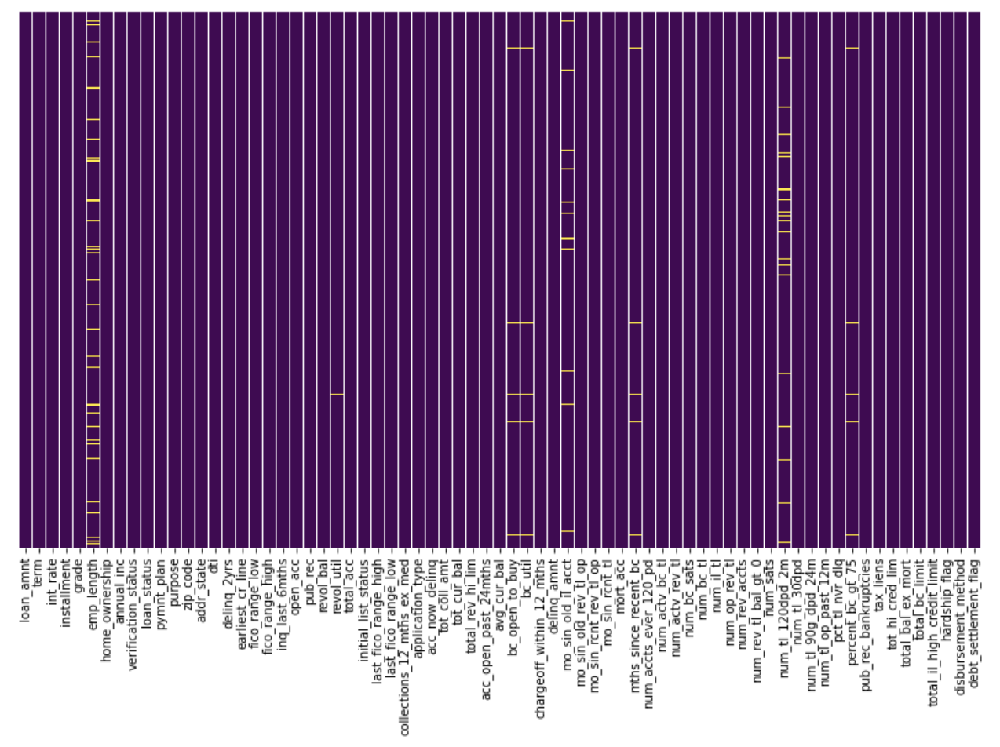
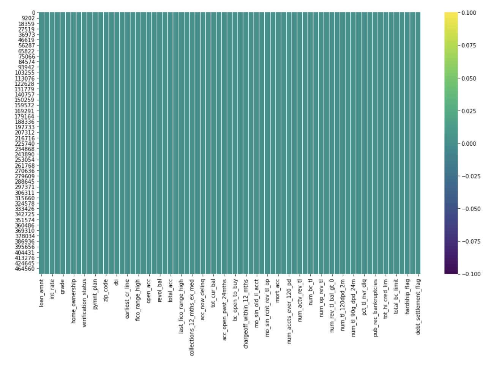
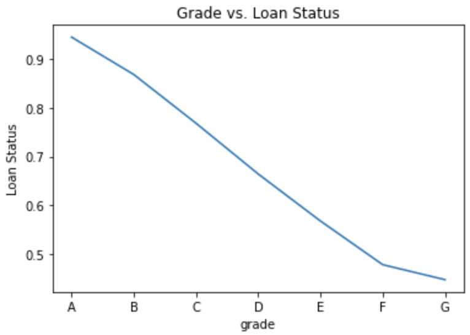
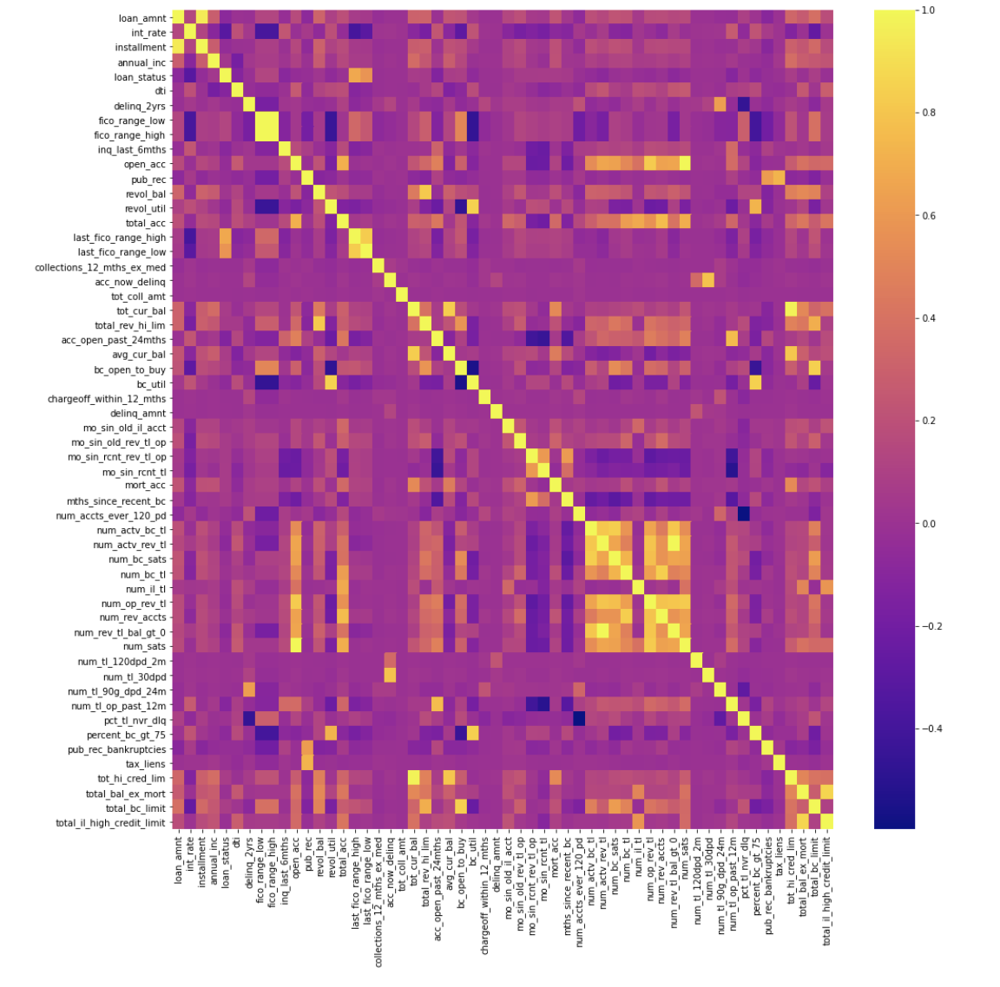
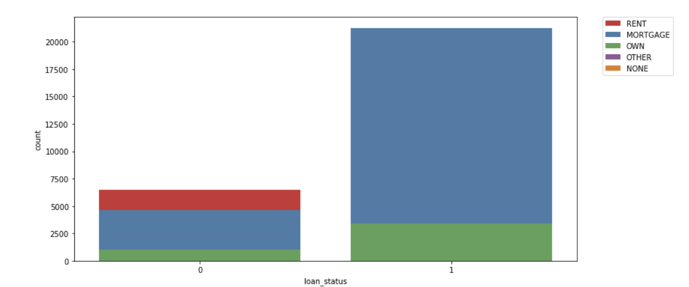
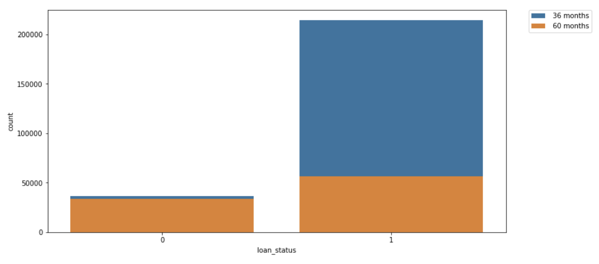
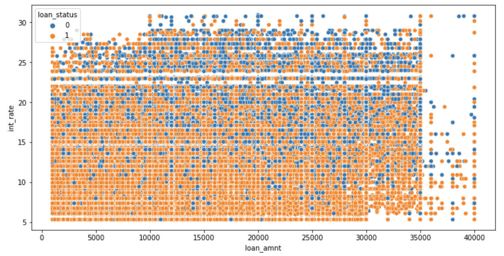
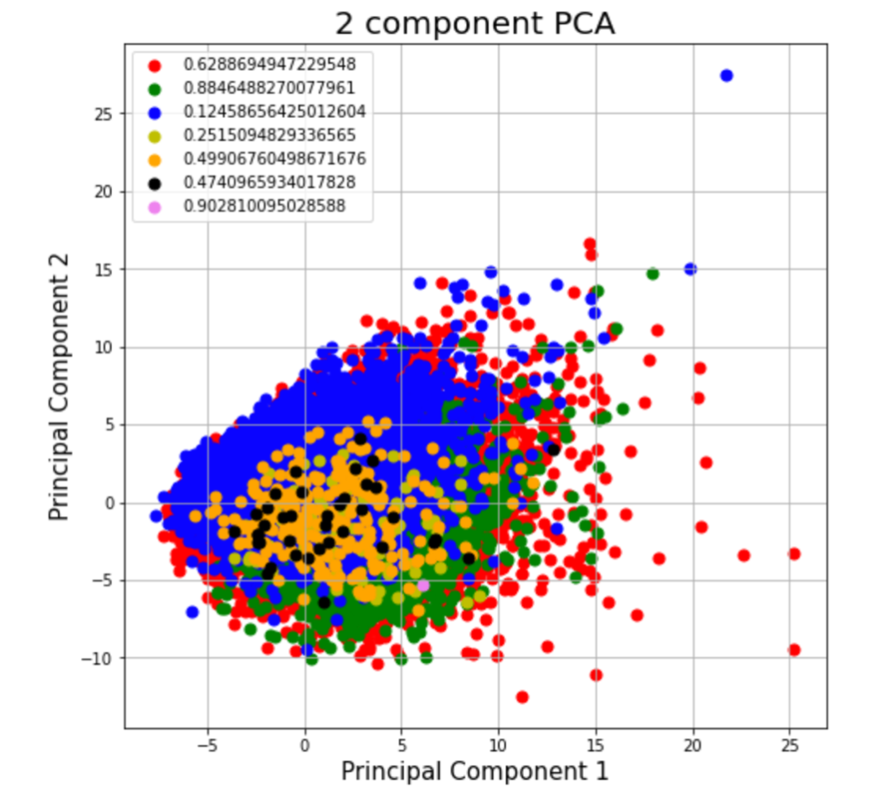

# Predicting whether People will Default on Loans or Not
##### Saurav Desai, Aarun Srinivas, Kanav Garg, Krish Dholakia, Rahul Hardikar

### Introduction/Background

Finances are an incredibly important part of everyday life. One of the most important verticals within finance is credit and lending. The ability to accurately determine whether the credit-worthiness of an individual and the likelihood that an individual will return the capital, is key to building sustainable financial institutions over the long run. Beyond just financial institutions, it is critical that we - as people - are able to accurately model our own credit, to help prevent us from being overextended, and taking on larger debt than we might reasonably be able to pay off. Thus, the aim of our project will be to determine whether someone will default or not on their loan.

### Problem Definition

For this class, we will be building a model to make predictions on whether a loan will default or not. For this analysis, we will be analyzing over 75 signals to determine whether an individual will default or not on their loans. Noise will be a major factor, and denoising the data to get the appropriate signal/noise ratio will be crucial to our success in this project. In particular, we will be analyzing data that involves details such as - the loan amount provided, the annual income of an individual, the interest rate, etc.

### Methods

There are several methods worth investigating. They are mentioned below, however, these are subject to change as we evolve our approaches to produce more accurate results. 

1. Logistic Regression
2. Random Forest
4. K-means Clustering
5. PCA

### Data Cleaning

Since there are so many features and rows in our dataset, we had to devote a significant amount of time (more than we expected) towards cleaning the data.

Our dataset consists of more than 5-10 million datapoints, which would require a lot of resources to analyze and process, so, we decided to only consider the first 500,000 entries for exploratory data analysis and preliminary statistical learning. 

The dataset consists of over 150 columns, out of which multiple columns seems to have incomplete data. First, we eliminate all columns with more than 10% missing data entries, since these wouldn’t be helpful in finding correlations. We also eliminate all loans that have a “current” status since these do not have an outcome yet. 

By applying some basic domain knowledge, we were able to eliminate more irrelevant columns such as loan id, urls, employment titles, etc. and duplicate columns (funded_amnt, funded_amnt_inv), as these would not provide any predictive value to our model. We then create a heatmap of our dataset to visualize any missing data. 

Next, we simply drop any remaining data entries that have a null value, which completes our dataset. 

We still have ~70 features remaining, which is still very large. During our exploratory data analysis stage, we will attempt to find features that have higher correlations with loan outcomes to further eliminate unnecessary features. We would also attempt to use PCA to reduce our dimensionality.

Since one of our additional objectives is to use our model to predict the outcomes of rejected loan applications, we could select the 8 features that are available to us in the rejected dataset. 

Overall, since a financial institution usually doesn’t have too many features available on a client, it makes sense for us to trim down on our features significantly and weigh features such as fico scores, loan grades, and interest rates more since these are known to be relevant and available in most loan applications. 

#### Data Encoding

Since a few of our columns are strings, we must encode this into numeric values so a classification model understands the data. For the loan status column, we chose to define all good loans as 1 and bad loans as 0. So, all loan statuses that are negative (Charged off, Late on payments), are replaced with 0. For all other columns, we run a simple loop where we assign a random integer value to every unique value in a particular column. 

### Visualizing our Dataset

#### Grade, Interest Rate, and Status

The above two images show the relationship between loan grade, interest rate, and the loan status (1 or 0) which was described above. We see that alphabetically the lowest grade gets the lowest interest rate, however the number of defaulters is roughly half for each category. 

#### Feature Correlation

This heatmap tracks the correlation between different features of our dataset. We can see here that the loan status is highly correlated to last_fico_range_high and last_fico_range_low. This intuitively makes sense as the fico score tracks the borrower’s credit reports to assess credit risk which corresponds to their ability to pay back the loan. 

#### Loan Type and Reason

The above two visualizations show the relationship between the above described loan status (1 or 0) and loan duration and reason. In the second image, it can be seen that loans paid on time are usually 36 months long. 

#### Total Loan Amount, Status, and Interest Rate

The above graph demonstrates that high amount loans with high interest rates are more likely to be defaulted on. Specifically, towards the bottom left corner where the loan amount and interest rates are small, a large concentration of loans that did not get defaulted on can be seen. On the other hand, towards the top right corner where the loan amount and interests rates are both high, a large concentration of loans that did get defaulted on can be seen.

### Results so far

#### Exploratory Data Analysis

To begin with, we ran 2 component PCA on the dataset. This was done to help us understand whether there were any individual features which could provide significant information. However, the explained variance on 2 component PCA is - [0.11820207, 0.07089925]. Our explained variance is at a combined 18% of information. This is fairly low, indicating a 2 component PCA analysis is a fairly poor way of analysing data and seeing patterns within the same. 

Another approach we tried was by running the correlation function offered by pandas. We chose to use ‘loan_status’ as our reference point, and mapped all strings in the dataset with unique numbers. We then set a correlation threshold of +/- 0.5 (i.e. only consider those features which had a correlation w/ loan_status < -0.5 or >0.5). 

The only 2 features that met this threshold were the last_fico_range_high and last_fico_range_low. However, when we plotted the data, we weren’t able to extract too much valuable information from these columns. 

#### Logistic Regression

We trained a logistic regression model with the data we had available to us from Kaggle. First, we removed/replaced columns with string entries, as this would cause errors with our model. Then, we chose 10 features based on the data visualization on correlation mentioned earlier. 

We used a simple 70/30 train-test split to fit the model and then to predict. We have approximately 81K occurrences of class 1 (accepted loans) and 21K occurrences of class 0 (defaulted loans). This may indicate that our dataset for this experiment was biased. 
 
This may also have resulted in significantly better classification for class 1 compared to class 0. Working with the current dataset, we have 79% precision for class 0 and 93% for class 1. We see that the overall accuracy of this model is pretty high ~90%.

#### Random Forest

We decided to run another supervised ML model on our dataset: Random Forest. We ran it on the same data that we ran the logistic regression model on. We wanted to get the random forest model to determine loan status (explained above). 

The precision for class 0 was 0.77 and the precision for 1 was 0.94. The overall accuracy of the model was 91%. It was very slightly better than logistic regression, but overall very similar in its performance. 

We had hoped that random forest would get better results than logistic regression, but the improvement was only very small. 

#### K-Means Clustering

To approach this in a different way, we tried using an unsupervised method: K-means clustering. We had the same goal in mind for this method, and that was to try and distinguish between 0 and 1 in the loan status column. 

However, the accuracy was quite bad with K-means. We only had 0.23 precision for class 0 and 0.84 precision for class 1. This is significantly lower than all of our other models. 

After running the model, we believed that there were too many features in the dataset for K-means to have a good accuracy. Additionally, from our PCA analysis, we also learned that there wasn't enough info gain for any of the features for K-means to work well. 

### Discussion

Since the ability for a person to return capital is dependent on a multitude of factors, we have the dual challenge of a) ensuring we cover as many potential signals as possible b) we weight these signals appropriately. Our ability to weigh these signals will partially depend on the size and nature of our training data. If our data is too sparse, we might overweight certain features, harming the accuracy of our loan prediction model. However, a good loan prediction model can have a powerful impact in the world of finance - potentially allowing millions of people who might otherwise have been rejected to gain access to appropriate financial resources. We can further leverage the fact that as the field of AI advances, loan prediction models will become increasingly accurate and unbiased. 

### Conclusion

After doing all the work, it can be seen that two of our models had a good accuracy: Random Forest and Logistic Regression. While random forest had a slightly better accuracy (about 1% better), it was fairly similar to logistic regression. Our unsupervised model, K-means, performed poorly, possibly due to there being a lot of features and the fact that none of the features had enough info-gain for them to make a significant impact. 

From analyzing the results, we realized that our dataset might have been biased. There were a lot more examples of accepted loans, which may have skewed the results in a way we didn't want. Additionally, while doing a 70-30 split, the 30% that was used for testing was not a lot of data in absolute terms. We only used a portion of the overall dataset in our project, so a way to get a more accurate representation of model performance would be to run it on larger datasets.

### Dataset
- [Lending Club Dataset from Kaggle](https://www.kaggle.com/wordsforthewise/lending-club)

### Team Contribution Notes

All members of the team contributed equally on all tasks involved. We held group meetings to work together.

### References

1. https://medium.com/devcareers/loan-prediction-using-selected-machine-learning-algorithms-1bdc00717631
2. https://towardsdatascience.com/predict-loan-eligibility-using-machine-learning-models-7a14ef904057
3. https://www.jstor.org/stable/1991095

